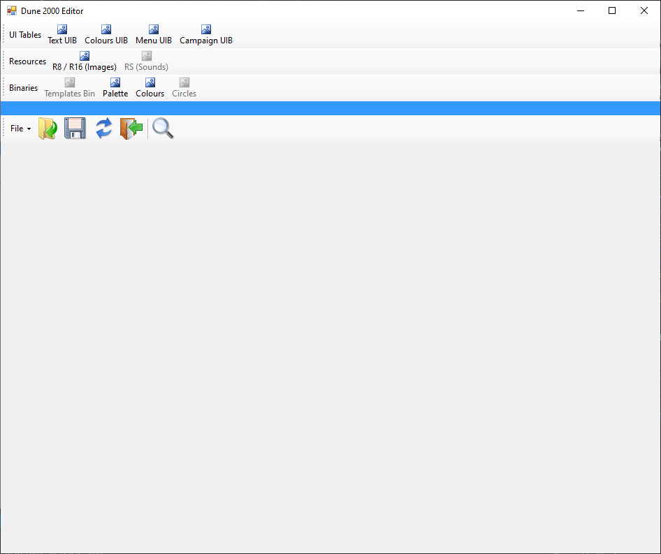

## Dune 2000 Editor Tools

The UI editor offers editing capabilities for several game data files.

### UI Table Editor

The UI editor currently includes editing capabilities for the following .UIB files

---

**Text UIB** 

[Link](editor/uibText.md)

[File Format](spec/uibText.md)

 - text.uib, including language-specifc equivalents and user-defined text tables

 - samples.uib

---

**Colours UIB** 

[Link](editor/uibColours.md)

[File Format](spec/uibColours.md)

 - colours.uib

---

**Menus UIB** 

[Link](editor/uibMenus.md)

[File Format](spec/uibMenus.md)

 - menus.uib

---

**Campaign UIB** 

[Link](editor/uibCampaign.md)

[File Format](spec/uibCampaign.md)

 - campaign.uib

### Resources File Editor

The UI editor currently includes editing capabilities for the following resource (.Rx) files

**Image Resources** 

[Link](editor/r8r16.md)

 - Data.R8

 - Data.R16

 - Tilesets (BLOXBASE, BLOXBAT, BLOXBGBS, ... and user-defined tilesets)

### Binary File Editor

The UI editor currently includes editing capabilities for the following resource (.Rx) files

**Palette Binaries** 

[Link](editor/binPalette.md)

 - Palette.bin

**House Palette Binaries** 

[Link](editor/binColours.md)

 - Colours.bin

