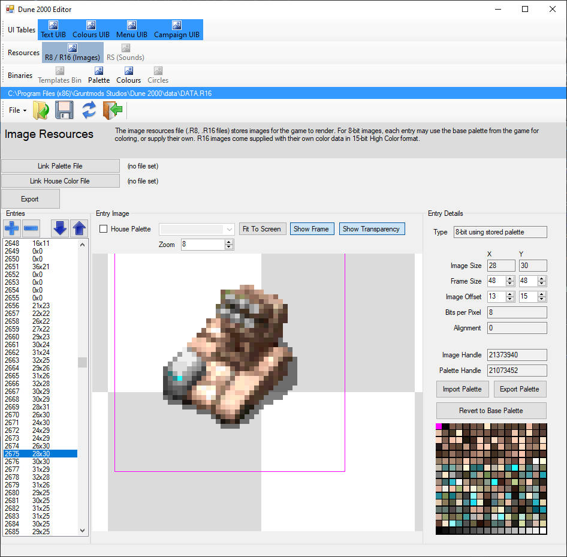
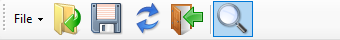
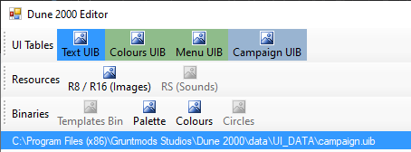
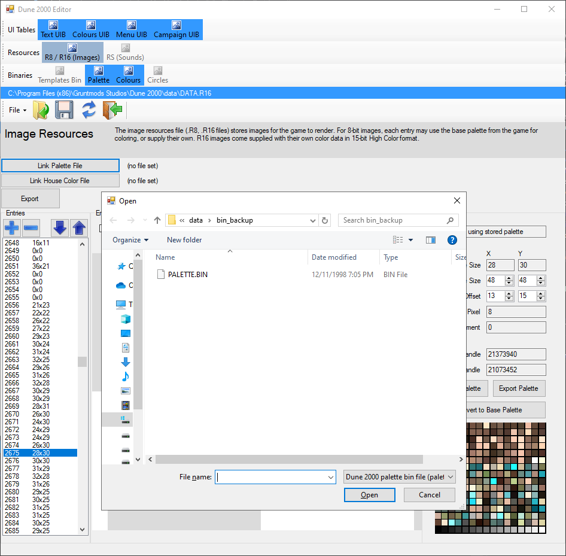
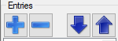
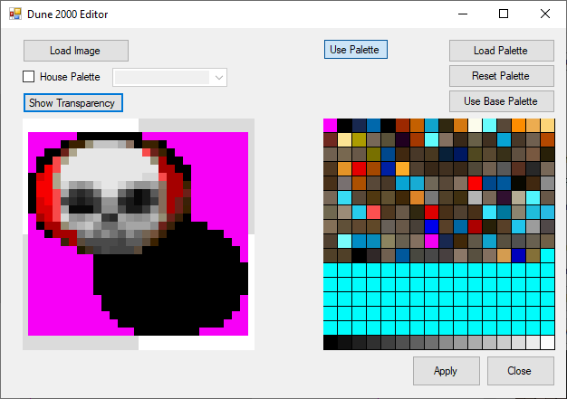
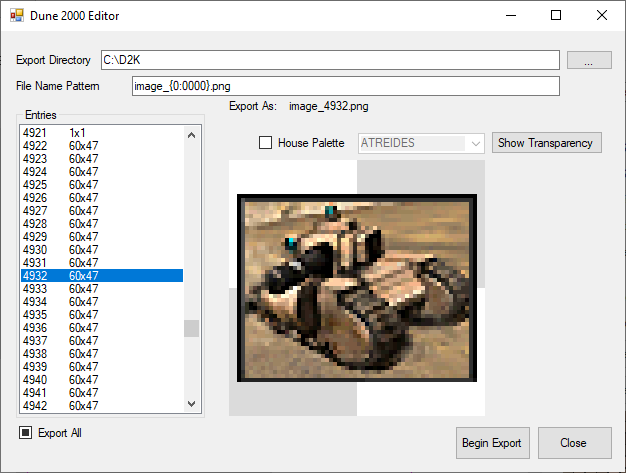

[Return to Editor index](../editor.md)

### Image Resources Editor

The Dune 2000 image resource files (.R8 for 8-bit images, .R16 for 16-bit images) are 

**Note!** This editor is not yet capable of handling UIBB and UILang files. This functionality will be built as a future function.

#### Editor Controls

Each editor offers the following basic controls, in order from left to right:

 - File: Contains (Open, Save, Save As, Reload, Unload)

 - Open: Opens a file, and enables the editor.

 - Save: Saves the file.

 - Reload: Reverts the file to its last saved state.

 - Unload: Closes the current file and disables the editor. Prompts if you have unsaved changes.

 - Search: Not available in this editor.

#### Editor State and Unsaved Changes

The color of the tab and title bar indicates if you have unsaved changes (which you will be warned about if the program attempts to close it without saving)
The blue color indicates an opened file without unsaved changes, and the green color indicates the presence of unsaved changes.

#### Linking Subordinate Files

To make full use of this editor, it is recommended to link this file with other subordinate files.

For this editor, the additional files are the main Palette file and the House Palette file. These are used when the image specifies that it uses palette information from either file.

#### Selecting Image Entries

To select an image entry to view / modify, select it from the numbered Entries list in the left panel

#### Editing Image Entries

The right panel allows you to modify the following attributes of an image entry:

 - Frame Size

 - Image Offset

 - Palette (For 8-bit images only, you can either export the palette currently used by the image, or replace it by importing one, or set the palette to the base palette)

#### Rearranging, Adding, Removing Image Entries

To rearrange the order of entries, use the up and down buttons at the top of the left panel, just above the entry list.

To remove an entry, use the minus / substraction button above the entry list. This deletes the entry from the list.

To add an entry, use the plus / addition button above the entry list. This opens a dialog for you to load the required information required to create a new entry.

 - Load Image: Opens a dialog to import a image file. Limited to 255x255 size.

 - Use Palette: If disabled, the entry will be converted to a 15-bit color entry. If enabled, the entry will be a 8-bit entry referencing a palette.

 - Load Palette: Opens a dialog to import a palette. The image will then be mapped to this palette.

 - Reset Palette: Reverts the palette. Usually this is the palette of the entry preceding the entry you want to add.

 - Use Base Palette: The entry will use the base palette.

#### Exporting as Images

To retrieve image information, click on the Export button above the entry list. This opens a dialog for you to define the export details.

 - Export Directory: The folder directory to save the image(s) to.

 - File Name Pattern: Defines the file name, including the file extension. Allows an additional expression for the entry number. The "Export As" line provides feedback on the file name as you edit this information.

 - Entries: Allows you to select which images to export. Additionally, an Export All option is given for exporting all images.
